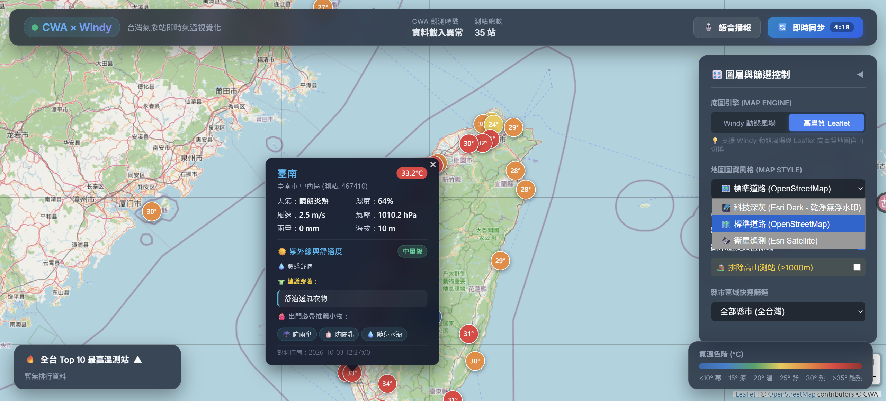
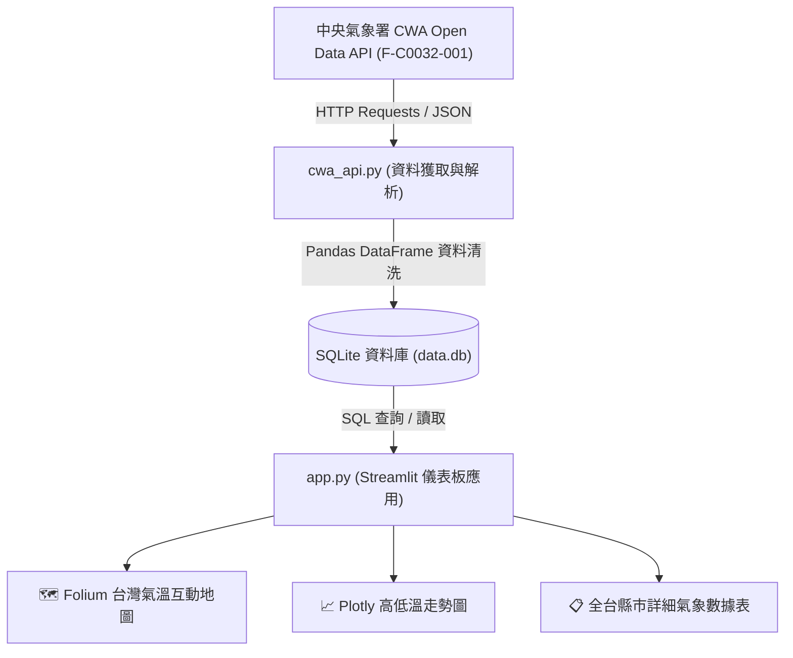
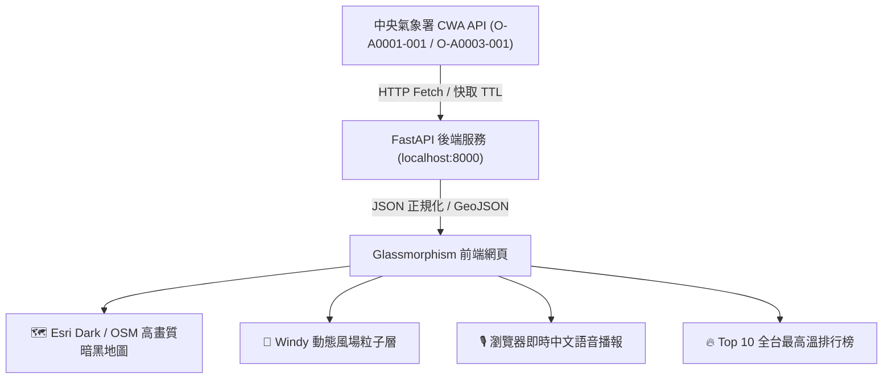

# 🇹🇼 Taiwan Weather Forecast & CWA × Windy 台灣即時氣溫視覺化平台

[](https://github.com/naz0914/1003)
[](https://www.python.org/)
[](https://fastapi.tiangolo.com/)
[](https://streamlit.io/)
[](https://opendata.cwa.gov.tw/)

> 本專案結合**中央氣象署 (CWA) 開放資料**、**SQLite 結構化存儲**、**Windy Map Forecast API** 與 **Leaflet 高解析度地圖**，打造具備即時資料串接、7 階氣溫色階、Top 10 排行榜、高山海拔篩選與瀏覽器語音播報的現代化全方位氣象平台。

---

## 📸 實機畫面展示 (Live Preview)

<div align="center">
  
  <p><em>▲ CWA × Windy 台灣即時氣溫播報系統：測站氣溫色階標記、紫外線等級、建議穿著與出門必備小物指南</em></p>
</div>

---

## 🌐 網站與專案相關連結 (Important Links)

| 項目名稱 | 連結網址 | 說明 |
| :--- | :--- | :--- |
| 📦 **GitHub 專案倉庫** | [https://github.com/naz0914/1003](https://github.com/naz0914/1003) | 完整開源原始碼與版本控制紀錄 |
| 🗺️ **CWA × Windy 即時地圖 (本地)** | [http://localhost:8000](http://localhost:8000) | 現代化暗黑地圖、氣象測站標籤、語音播報 |
| 📖 **FastAPI Swagger API 文件** | [http://localhost:8000/docs](http://localhost:8000/docs) | 互動式 RESTful API 文件與在線測試 |
| 📊 **Streamlit 氣象預報儀表板 (本地)** | [http://localhost:8501](http://localhost:8501) | 36小時高低溫走勢、Folium 地圖、歷史查詢 |
| 📡 **中央氣象署 CWA 開放資料平台** | [https://opendata.cwa.gov.tw/](https://opendata.cwa.gov.tw/) | 氣象資料來源與 API Key 申請入口 |
| 💨 **Windy 開發者平台 (Map Forecast API)** | [https://api.windy.com/](https://api.windy.com/) | 國際級動態風場與氣象底圖 API 文件 |

---

## 📌 系統架構流程圖 (System Architecture)

### 模式一：24 步微課程標準資料管線流程圖 (Streamlit + SQLite)



---

### 模式二：CWA × Windy 現代化即時地圖與語音播報架構 (FastAPI + Leaflet)



---

## 🗺️ 24 步開發藍圖實現對照 (Curriculum Mapping)

| 階段 | 步驟 | 核心任務 | 對應實作檔案 / 模組 |
| :--- | :--- | :--- | :--- |
| **Phase 1: 資料獲取與解析** | Steps 1~6 | CWA API 串接、取得 JSON、提取縣市與 MinT/MaxT | `cwa_api.py` (`fetch_cwa_weather`, `parse_weather_json`) |
| **Phase 2: 資料處理與存儲** | Steps 7~10 | Pandas DataFrame 清洗、設計 SQLite Table、SQL 存取 | `database.py` (`init_db`, `save_forecasts`, `get_all_forecasts`) |
| **Phase 3: 儀表板介面開發** | Steps 11~16 | Streamlit 基礎建構、縣市選單、氣溫折線圖、版面整合 | `app.py` (Tab 2: 氣溫趨勢分析與時段預報表) |
| **Phase 4: 進階視覺化與優化** | Steps 17~20 | Folium 台灣地圖、溫度色階標記、時段切換器、效能快取 | `app.py` (Tab 1: 台灣氣象地圖與指標卡片) |
| **Phase 5: 版本控制與上線** | Steps 21~24 | Git 提交、推送 GitHub 倉庫、架構回顧與延伸應用 | Git Commit & Push / 專案文檔與教學說明 |

---

## 🚀 快速啟動指南 (Quick Start)

### 1. 安裝環境與套件

```powershell
# 建立並進入虛擬環境 (如已有 .venv 可略過)
python -m venv .venv
.\.venv\Scripts\Activate.ps1

# 安裝所有必要套件
pip install -r requirements.txt
```

---

### 2. 啟動模式一：【CWA × Windy 現代化即時地圖與語音播報版】

```powershell
.venv\Scripts\python.exe run.py
```
> 啟動後系統會**自動在瀏覽器開啟** [http://localhost:8000](http://localhost:8000)
> - 🌌 **免金鑰高畫質底圖**：採用 Esri Dark Gray 科技暗黑地圖（完全無浮水印）。
> - 🎙️ **即時語音播報**：點擊「語音播報」按鈕，聆聽全台即時氣候概況。
> - 🔥 **Top 10 排行榜**：點擊排行榜測站，地圖平滑飛行 (flyTo) 到該測站並展開卡片。
> - ⛰️ **高山篩選**：勾選「排除高山測站 (>1000m)」，專注生活平地氣溫。

---

### 3. 啟動模式二：【Streamlit 台灣氣象預報儀表板版】

```powershell
.venv\Scripts\python.exe -m streamlit run app.py
```
> 啟動後自動開啟 [http://localhost:8501](http://localhost:8501)
> - 包含全台 22 縣市 36 小時預報時段切換、高低溫雙曲線走勢圖與 SQLite 資料庫歷史查詢。

---

## ☁️ 如何將網站免費部署至雲端 (Deploy Online)

若想讓其他人也可以透過手機或公開網址瀏覽您的成品，推薦以下免費部署方式：

### 方式 A：部署 Streamlit 版至 Streamlit Community Cloud (最簡單)
1. 前往 [Streamlit Community Cloud](https://share.streamlit.io/) 並使用 GitHub 帳號登入。
2. 點選 **"New app"**。
3. Repository 選擇 `naz0914/1003`，Main file path 輸入 `app.py`。
4. 點選 **"Deploy!"**，幾分鐘後即可取得專屬公開網址（例如：`https://1003-weather.streamlit.app`）。

### 方式 B：部署 FastAPI 版至 Render 或 Railway
1. 前往 [Render.com](https://render.com/)，點選 **New Web Service** 連接 GitHub 倉庫 `naz0914/1003`。
2. Build Command 設定：`pip install -r requirements.txt`
3. Start Command 設定：`uvicorn backend.app.main:app --host 0.0.0.0 --port $PORT`
4. 部署完成即可獲得公開 HTTPS 網址！

---

## 🔑 中央氣象署 (CWA) API 授權碼設定

本專案已在 `.env` 中為您配置授權碼：
```env
CWA_API_KEY=CWA-8C2E2368-812D-4F61-8F55-8AFC60837532
```
若需更換，可至 [中央氣象署開放資料平台](https://opendata.cwa.gov.tw/) 登入會員並在「取得授權碼」重新生成。

---

## 📂 專案檔案結構清單

```text
hw3/
├── run.py                       # 🚀 模式一啟動入口 (FastAPI + 自動開啟瀏覽器)
├── app.py                       # 📊 模式二啟動入口 (Streamlit 網頁儀表板)
├── design.md                    # 📑 5 大補強架構設計規格書
├── README.md                    # 📖 專案綜合說明文件與連結導航
├── requirements.txt             # 專案相依套件清單
├── data.db                      # SQLite 本地氣象資料庫
├── .env                         # 本地環境變數設定
│
├── backend/                     # FastAPI 後端模組
│   ├── requirements.txt
│   ├── .env.example
│   └── app/
│       ├── main.py              # FastAPI 核心應用與靜態檔案路由
│       ├── config.py            # 設定載入
│       ├── schemas/             # Pydantic 資料模型 (Station, GeoJSON, Health)
│       ├── services/            # CWA 資料抓取、清洗與快取
│       ├── routers/             # API 路由 (/latest, /geojson, /health)
│       └── jobs/                # 背景定時刷新排程
│
└── frontend/                    # 現代化純前端 UI 介面
    ├── index.html               # 玻璃擬態主頁面
    ├── css/style.css            # 暗黑科技感樣式表
    └── js/                      # 模組化 JS (地圖載入器、色碼表、API客戶端)
```
